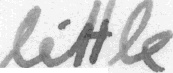
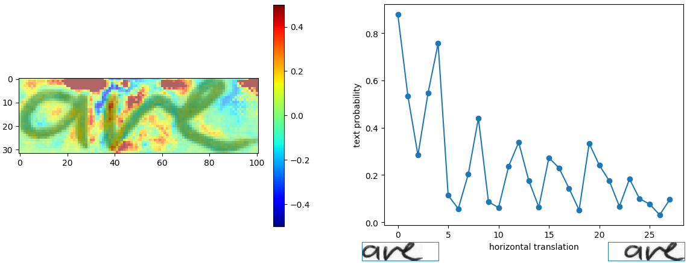

# Réseau de neurones pour écriture manuscrite

**Projet 2A Ensisa(2018-2019):**

Reconnaissance d’écriture manuscrite par un réseau de neurones artificiel avec `Tensorflow, OpenCV, Keras...` . Handwritten Text Recognition HTR.                                     


### Remerciements
Grand merci à **Mr. Michel HASSENFORDER** (professeur ENSISA Mulhouse France) pour son encadrement et ses précieux conseils tout au long de ce projet.
Merci également à [**@Harald Scheidl**](https://github.com/githubharald)  pour ses travaux sur lesquels nous nous sommes appuyé pour approfondir notre projet suivant notre problématique.

#### authors :
* Melchior OBAME OBAME 
* Saad BENDAOUD                     
-----------------------------------------------------------------------------------
         
         
                       
               
**Remarque:** au cours de cette lecture , `user_name` fait reférence au nom réel d'un utilisateur.
## Lancer la demo | Run demo

1. Se rendre dans le dossier `model/` et dézipper `model.zip`( pre-trained model on IAM dataset).
Attention : les fichiers dézipés doivent directement être mis dans le dossier `model/`
de même ,pour un nouvel utilisateur ces fichiers doivent être mis dans `model/user_name` où `user_name` est le nom de l'utilisateur

2. se rendre dans `src/` et lancer `python main.py` . 
Image de test et un resultat attendu





```
> python main.py
Validation character error rate of saved model: 10.624916%
Init with stored values from ../model/snapshot-38
Recognized: "little"
Probability: 0.96625507
```

testé avec :

* Python 2 and Python 3 and python 3.6.8
* TF 1.3, 1.10 and 1.12 (confère **requirements.txt**)
* Ubuntu 16.04 ,17.04   and Windows 7,10


## Arguments du main.py : Opérations

* `--train`: train the NN, details see below.
* `--validate`: validate the NN, details see below.
* `--beamsearch`: use vanilla beam search decoding (better, but slower) instead of best path decoding.
* `--wordbeamsearch`: use word beam search decoding (only outputs words contained in a dictionary) instead of best path decoding. This is a custom TF operation and must be compiled from source, more information see corresponding section below. It should **not** be used when training the NN.
* **Arguments ajoutées**
* `--user` ou juste `-u` : selection de l'utilisateur sur le quel les actions seront effectuées  (ex : `python main.py --user Dupond` ), si on ne le précise pas , les actions seront menées sur l'utilisateur principal(par défaut)
* `--dump`: enregistrement de la sortie du réseau de neurone pour une image dans un fichier CSV.
* `--segmentation` ou juste `-s`  :  segmente le mot contenu dans l'image(par exemple si on une une courte phrase) et les sauvegarde dans `data/user_name/outSegmentation/` (pour un utilisateur) ou juste `data/outSegmentation/`

## Arguments du users.py : Gestion des utilisateurs
Si aucun utilisateur n'est renseigné , les actions (train, validatio, infer...) sont fait sur l'utilisateur par défaut (général)
* `--addUser` (-a): add a new user   (ex : `python users.py --addUser Dupond`).
* `--removeUser` (-r): remove an user (ex : `python users.py --removeUser Dupond`). 
* `--removeAllUsers` (-ra): remove all users (ex : `python users.py -ra`). 
* `--printUsers` (-pu): show all users created.
* `--formated`: format model of an user 
* `--user` (-u): select an user for example if it is to format his model (ex : `python users.py -u --formated`).


## Emplacement des fichiers dans le cas de l'ajout d'un utilisateur ##

soit **user_name** le nom de l'utilisateur 
Quand un nouvel utilisateur est ajouté, son nom est ajouté dans le fichier `model/userList.txt`.
Ses données sont dans `data/user_name` et son model dans `model/user_name`.

cet utilisateur peut être créé déjà entrainé (si bien sûr l'utilisateur géneral l'était déja)(ne pas mettre l'option --formated) ou non-entrainé (`python users.py -a Dupond --formated`)

If neither `--train` nor `--validate` is specified, the NN infers the text from the test image (`data/user_name/test.png` for an user or just `data/test.png` for the default user).

Two examples: if you want to infer using beam search, execute `python main.py --beamsearch`, while you have to execute `python main.py --train --beamsearch` if you want to train the NN and do the validation using beam search.


## Integrate word beam search decoding  ( Seulement sur un environement Linux )

Besides the two decoders shipped with TF, it is possible to use word beam search decoding \[4\].
Using this decoder, words are constrained to those contained in a **dictionary**, but arbitrary non-word character strings (numbers, punctuation marks) can still be recognized.
The following illustration shows a sample for which word beam search is able to recognize the correct text, while the other decoders fail.


Instructions à suivre pour intégrer Word Beam Search decoding:

1. Clone repository [CTCWordBeamSearch](https://github.com/githubharald/CTCWordBeamSearch).
2. Compile custom TF operation (follow instructions given in README).  (on a Linux environement only)
3. Copy binary `TFWordBeamSearch.so` from the CTCWordBeamSearch repository to the `src/` directory of the SimpleHTR repository.

Word beam search can now be enabled by setting the corresponding command line argument.
The dictionary is created (in training and validation mode) by using all words contained in the IAM dataset (i.e. also including words from validation set) and is saved into the file `data/corpus.txt`.
Further, the (manually created) list of word-characters can be found in the file `model/wordCharList.txt` or `model/user_name/wordCharList.txt` if it is use by an user .
Beam width is set to 50 to conform with the beam width of vanilla beam search decoding.


Using this configuration, a character error rate of 8% and a word accuracy of 84% is achieved.

## Entrainement du model

### IAM dataset

The data-loader expects the IAM dataset \[5\] (or any other dataset that is compatible with it) in the `data/` directory.
Follow these instructions to get the dataset:

1. Register for free at this [website](http://www.fki.inf.unibe.ch/databases/iam-handwriting-database).
2. Download `words/words.tgz`.
3. Download `ascii/words.txt`  (his format **a0-000-00-01 ok X X X X X X X a** must be changed by **a0-000-00-01 a**)
4. Put `words.txt` into the `data/` directory.
5. Create the directory `data/words/`.
6. Put the content (directories `a01`, `a02`, ...) of `words.tgz` into `data/words/`.
7. convert and change structure of `words.txt` to the JSON format with the new structure with `src/data/convertToJSON.py`
**warning**:
 Format of Your `words.json` :
```
{
img1 : "hello"
    ...
imgX : "good"
}
```
 With each key is the path like in words.txt(first column) and each value is the ground truth label for that image, this code will works fine.

8. Go to `data/` and run `python checkDirs.py` for a rough check if everything is ok.

If you want to train the model from scratch, delete the files contained in the `model/` directory or for an user run `python users.py -u user_Name --formated and then run the trainning`
Otherwise, the parameters are loaded from the last model-snapshot before training begins.
Then, go to the `src/` directory and execute `python main.py --train` or `python main.py --train --user user_Name` to do training with an user .
After each epoch of training, validation is done on a validation set (the dataset is split into 95% of the samples used for training and 5% for validation as defined in the class `DataLoader`).
If you only want to do validation given a trained NN, execute `python main.py --validate` or `python main.py --user user_Name --validate`.
Training on the CPU takes 18 hours on my system (VM, Ubuntu 16.04, 8GB of RAM and 4 cores running at 3.9GHz).
The expected output is shown below.

```
> python main.py --train
Init with new values
Epoch: 1
Train NN
Batch: 1 / 500 Loss: 130.354
Batch: 2 / 500 Loss: 66.6619
Batch: 3 / 500 Loss: 36.0154
Batch: 4 / 500 Loss: 24.5898
Batch: 5 / 500 Loss: 20.1845
...

Validate NN
Batch: 1 / 115
Ground truth -> Recognized
[OK] "," -> ","
[ERR:1] "Di" -> "D"
[OK] "," -> ","
[OK] """ -> """
[OK] "he" -> "he"
[OK] "told" -> "told"
[ERR:2] "her" -> "nor"
...
Character error rate: 13.956289%. Word accuracy: 67.721739%.
```

### Other Dataset

Either convert your dataset to the IAM format (look at `words.txt` and the corresponding directory structure) or change the class `DataLoader` according to your dataset format.


##Création d'une base de données plus Grande

en fusionnant les images la base de données [**MNIST**](http://yann.lecun.com/exdb/mnist/train-images-idx3-ubyte.gz) (en s'assurant au préalable de respecter la structure des fichiers ) avec celles de la base **IAM**.
Il est aussi possible de télécharger des polices de caractères de style manuscrits et ainsi les appliquer sur les caractères alphabétiques ainsi que sur les caractères spéciaux en les enregistrant dans des images à compléter dans la base de données.


## Data Augmentation
La data augmentation est faite en faisant des distorsions aléatoires sur les images d'entrainement .
95% des données sont allouées au training et 5% à la validation.
elle n'est pas faite de telle sorte à enregistrer les fichiers dans l'ordinateur  , 
elle est faite lors du chargement de'une image dans le reseau , ceci afin d'occuper de l'espace disque inutilement.


## Information about model
ce model (`model/model.zip`) n'est pas complétement entrainé (par manque de temps).
Les données peuvent être complétées dans `data/words` en pensant bien sûr à completer également le fichier `words.json`

### Architecture du reseau de neurones (model)

The model \[1\] is a stripped-down version of the HTR system I implemented for my thesis \[2\]\[3\].
What remains is what I think is the bare minimum to recognize text with an acceptable accuracy.
The implementation only depends on numpy, cv2 and tensorflow imports.
It consists of 5 CNN layers, 2 RNN (LSTM) layers and the CTC loss and decoding layer.
The illustration below gives an overview of the NN (green: operations, pink: data flowing through NN) and here follows a short description:

* The input image is a gray-value image and has a size of 128x32
* 5 CNN layers map the input image to a feature sequence of size 32x256
* 2 LSTM layers with 256 units propagate information through the sequence and map the sequence to a matrix of size 32x80. Each matrix-element represents a score for one of the 80 characters at one of the 32 time-steps
* The CTC layer either calculates the loss value given the matrix and the ground-truth text (when training), or it decodes the matrix to the final text with best path decoding or beam search decoding (when inferring)
* Batch size is set to 50


### Improve accuracy

74% des mots de l'IAM dataset sont bien reconnus par le réseau de neurone en utlisant le décodage Vanilla Beam search.

Pour améliorer la reconnaissance :

* Data augmentation : Application de transformations geometriques aléatoires sur les images d'entrainement.
* Ajouter plus de couches CNN.
* remplacer les neurones de type  LSTM par des 2D-LSTM sur les couches RNN.
* correction de texte : si le mot n'est pas dans le dictionnaire on prend le plus similaire.

### Analyze model

Run `python analyze.py` with the following arguments to analyze the image file `data/analyze.png` with the ground-truth text "are":

* `--relevance`: compute the pixel relevance for the correct prediction.
* `--invariance`: check if the model is invariant to horizontal translations of the text.
* No argument provided: show the results.

Results are shown in the plots below.
The pixel relevance (left) shows how a pixel influences the score for the correct class.
Red pixels vote for the correct class, while blue pixels vote against the correct class.
It can be seen that the white space above vertical lines in images is important for the classifier to decide against the "i" character with its superscript dot.
Draw a dot above the "a" (red region in plot) and you will get "aive" instead of "are".

The second plot (right) shows how the probability of the ground-truth text changes when the text is shifted to the right.
As can be seen, the model is not translation invariant, as all training images from IAM are left-aligned.
Adding data augmentation which uses random text-alignments can improve the translation invariance of the model.
More information can be found in [this article](https://towardsdatascience.com/6c04864b8a98).




## FAQ

1. I get the error message "Exception: No saved model found in: ... ": unzip the file `model/model.zip`. All files contained must be placed directly into the `model/` directory and **not** in some subdirectory created by the unzip-program.
2. I get the error message "... TFWordBeamSearch.so: cannot open shared object file: No such file or directory": if you want to use word beam search decoding, you have to compile the custom TF operation from source.
3. I get the error message "... ModuleNotFoundError: No module named 'editdistance'": you have to install the mentioned module by executing `pip install editdistance`.
4. Where can I find the file `words.txt` of the IAM dataset: it is located in the subfolder `ascii` of the IAM website And convert it to JSON white `data/convertToJSON.py`.
5. I use a custom image of handwritten text, but the NN outputs a wrong result: the NN is trained on the IAM dataset. The NN not only learns to recognize text, but it also learns properties of the dataset-images. Some obvious properties of the IAM dataset are: text is tightly cropped, contrast is very high, most of the characters are lower-case. Either you preprocess your image to look like an IAM image, or you train the NN on your own dataset. See [this article](https://medium.com/@harald_scheidl/27648fb18519).
6. I get an error when running the script more than once from an interactive Python session: do **not** call function `main()` in file `main.py` from an interactive session, as the TF computation graph is created multiple times when calling `main()` multiple times. Run the script by executing `python main.py` instead.


## References

\[1\] [Build a Handwritten Text Recognition System using TensorFlow](https://towardsdatascience.com/2326a3487cd5)

\[2\] [Scheidl - Handwritten Text Recognition in Historical Documents](https://repositum.tuwien.ac.at/obvutwhs/download/pdf/2874742)

\[3\] [Scheidl - Word Beam Search: A Connectionist Temporal Classification Decoding Algorithm](https://repositum.tuwien.ac.at/obvutwoa/download/pdf/2774578)

\[4\] [Marti - The IAM-database: an English sentence database for offline handwriting recognition](http://www.fki.inf.unibe.ch/databases/iam-handwriting-database)                 


